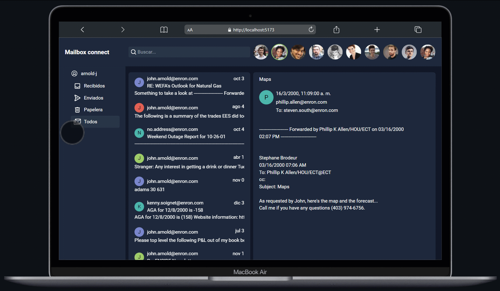

# 📬 Buzón de correo 📧 
## BackEnd
Recorre cada carpeta de usuario para extraer toda la data del correo  
Para más información: 👉 [`README`](back_end/README.md)

### Resultado
```json
{
  "_index": "allen-p",
  "_type": "_doc",
  "_id": "1TADRXR63TB",
  "_score": 1,
  "@timestamp": "2022-11-13T23:00:45.802377216Z",
  "_source": {
    "Body": "text content...",
    "Date": "Thu, 27 Dec 2001 15:34:09 -0800 (PST)",
    "Folder": "inbox",
    "From": "pepe.argento@gmail.com",
    "Subject": "Final Name Change Report - December 2001",
    "To": [
      "moni.argento@gmail.com",
      "coqui.argento@gmail.com"
    ]
  }
}
```
### Demo 🎬 


## Servidor
Obtiene lista de documentos por usuario, con datos extraidos por cada correo  
Para más información: 👉 [`README`](server/README.md)
```json
[{
  "_index": "allen-p",
  "_source": {
    "Body": "text content...",
    "Date": "Mon, 27 Nov 2000 08:37:00 -0800 (PST)",
    "Folder": "inbox",
    "From": "pepe.argento@gmail.com",
    "Subject": "asunto correo",
    "To": [
      "moni.argento@gmail.com",
      "coqui.argento@gmail.com"
    ]
  }
}]
```
## FrontEnd
Prototipo desarrollado bajo diseño atomico con figma y sitio web en Vue 3:  
Para más información: 👉 [`README`](front_end/README.md)

## Link proyecto 🌐 
 👉 [`URL`](https://bmolina1993.github.io/mailbox)

### Demo 🎬 


